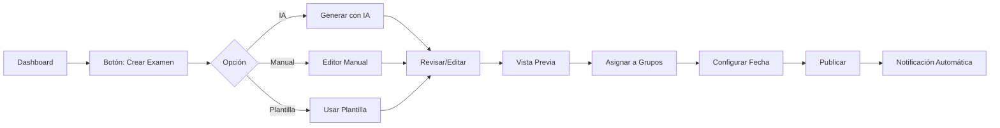
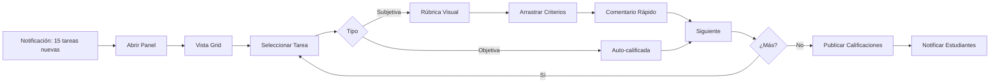
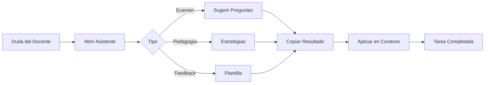

# 👩‍🏫 Análisis Completo del Entorno Docente - TutoriA Academy

## 📋 Resumen Ejecutivo

Este documento presenta un **análisis exhaustivo y propuesta de mejora** para el entorno del docente en TutoriA Academy, basado en mejores prácticas pedagógicas y tecnología educativa moderna.

---

## 🎯 Visión General del Usuario Docente

### Necesidades Principales
1. **Eficiencia:** Reducir tiempo administrativo
2. **Insights:** Datos accionables sobre estudiantes
3. **Herramientas:** Crear contenido de calidad rápidamente
4. **Comunicación:** Canal directo con estudiantes y padres
5. **Apoyo:** Asistencia pedagógica y técnica

### Flujo de Trabajo Típico
```
📅 Inicio del Día
  ├─ Revisar dashboard (alertas, pendientes)
  ├─ Planificar clases
  └─ Responder mensajes

📚 Durante Clases
  ├─ Monitorear participación en tiempo real
  ├─ Asignar actividades
  └─ Registrar observaciones

✅ Fin del Día
  ├─ Calificar tareas/exámenes
  ├─ Dar retroalimentación
  └─ Preparar material para mañana
```

---

## 🏗️ Arquitectura del Entorno Docente

### Componentes Principales

#### 1. **Dashboard Docente** 
**Estado Actual:** ✅ Funcional básico
**Mejoras Implementadas:**
- KPI cards con animaciones
- Alertas tempranas visuales
- Acciones rápidas con gradientes
- Progreso promedio del grupo

**Mejoras Pendientes:**
- [ ] Calendario integrado con eventos próximos
- [ ] Gráficas de tendencias (últimos 30 días)
- [ ] Widget de "Estudiantes que necesitan atención"
- [ ] Notificaciones en tiempo real
- [ ] Quick stats comparativas (mes actual vs anterior)

#### 2. **Asistente de IA** 
**Estado:** ✅ **IMPLEMENTADO**
**Archivo:** `components/teacher/TeacherAIAssistant.tsx`

**Funcionalidades:**
- ✅ Chat flotante siempre disponible
- ✅ Acciones rápidas (4 botones):
  - Crear Examen
  - Ideas Pedagógicas
  - Generar Preguntas
  - Retroalimentación
- ✅ Respuestas contextuales con formato Markdown
- ✅ Copiar respuestas al portapapeles
- ✅ Sistema de feedback (👍👎)
- ✅ Historial de conversación

**Casos de Uso:**
```typescript
// Ejemplo 1: Generar preguntas
"Genera 5 preguntas de opción múltiple sobre 
fotosíntesis para secundaria nivel intermedio"

// Ejemplo 2: Feedback constructivo
"Ayúdame a redactar feedback para un estudiante 
que tiene dificultades con álgebra pero se esfuerza"

// Ejemplo 3: Estrategias pedagógicas
"Dame ideas innovadoras para enseñar historia 
de México a preparatoria"
```

#### 3. **Gestor de Exámenes**
**Estado Actual:** ✅ Funcional (ExamBlueprintEditor)
**Mejoras Propuestas:**

**Debe incluir:**
- [ ] Generador de exámenes con IA
  - Seleccionar temas del temario
  - Elegir tipos de pregunta
  - Nivel de dificultad
  - Cantidad de preguntas
  - Generar automáticamente

- [ ] Banco de preguntas inteligente
  - Búsqueda semántica
  - Filtros por tema, dificultad, tipo
  - Estadísticas de desempeño por pregunta
  - Sugerencias de preguntas similares

- [ ] Preview en tiempo real
  - Vista de estudiante
  - Vista de respuestas
  - Estimación de tiempo

- [ ] Asignación flexible
  - Por grupo o estudiantes individuales
  - Fecha límite
  - Configuración de reintentos
  - Modo práctica vs evaluación

#### 4. **Sistema de Calificaciones**
**Estado:** 🔧 Requiere implementación completa

**Propuesta de Diseño:**

```typescript
interface GradingInterface {
  // Vista general
  pendingSubmissions: Assignment[];
  gradedSubmissions: Assignment[];
  
  // Calificación rápida
  rubrics: Rubric[];
  quickComments: string[];
  gradingScale: 'numeric' | 'letter' | 'emoji';
  
  // Batch grading
  selectMultiple: boolean;
  applyToAll: boolean;
  
  // Analytics
  classAverage: number;
  topPerformers: Student[];
  needsHelp: Student[];
}
```

**Características Clave:**
- ✅ Rúbricas visuales (drag & drop de criterios)
- ✅ Comentarios predefinidos (plantillas)
- ✅ Calificación por lotes (misma calificación a grupo)
- ✅ Vista comparativa (historial del estudiante)
- ✅ Retroalimentación multimedia (grabar audio, adjuntar imágenes)
- ✅ Exportar calificaciones (Excel, PDF)

#### 5. **Gestión de Tareas**
**Estado:** ❌ No implementado

**Propuesta:**

```typescript
interface Assignment {
  id: string;
  title: string;
  description: string;
  type: 'homework' | 'project' | 'reading' | 'research';
  
  // Asignación
  assignedTo: 'group' | 'individual' | 'selected';
  students: string[];
  groups: string[];
  
  // Fechas
  dueDate: Date;
  availableFrom?: Date;
  lateSubmissionAllowed: boolean;
  latePenalty?: number; // %
  
  // Archivos
  attachments: File[];
  maxFileSize: number;
  allowedFormats: string[];
  
  // Calificación
  maxPoints: number;
  rubric?: Rubric;
  autoGrade: boolean;
  
  // Notificaciones
  notifyOnSubmit: boolean;
  reminderDays: number[];
}
```

**Features:**
- [ ] Crear tarea con editor rico (texto, imágenes, videos)
- [ ] Adjuntar archivos de referencia
- [ ] Configurar criterios de evaluación
- [ ] Programar publicación
- [ ] Recordatorios automáticos
- [ ] Vista de entregas (grid/lista)
- [ ] Comparación de similitud (detectar plagio básico)

#### 6. **Banco de Preguntas**
**Estado Actual:** ✅ Funcional (ItemVirtualList + ItemEditor)
**Mejoras Propuestas:**

- [ ] Importación masiva (Excel, CSV)
- [ ] Exportación por tema
- [ ] Etiquetas personalizadas
- [ ] Dificultad calculada automáticamente (basada en % respuestas correctas)
- [ ] Compartir entre profesores
- [ ] Versionado (historial de cambios)
- [ ] Preguntas sugeridas por IA

#### 7. **Comunicación**
**Estado:** ❌ No implementado

**Propuesta de Sistema de Mensajería:**

```typescript
interface MessagingSystem {
  // Conversaciones
  threads: Thread[];
  unreadCount: number;
  
  // Tipos de mensaje
  sendTo: 'student' | 'group' | 'parents';
  messageType: 'announcement' | 'reminder' | 'feedback' | 'alert';
  
  // Características
  attachments: File[];
  scheduling: Date;
  readReceipts: boolean;
  requireAcknowledgment: boolean;
  
  // Templates
  savedTemplates: Template[];
  quickReplies: string[];
}
```

**Features Clave:**
- [ ] Mensajes individuales a estudiantes
- [ ] Anuncios grupales
- [ ] Contacto con padres/tutores
- [ ] Plantillas de mensajes
- [ ] Programar envíos
- [ ] Confirmaciones de lectura
- [ ] Adjuntar archivos
- [ ] Notificaciones push

#### 8. **Analytics y Reportes**
**Estado:** ⚠️ Básico

**Dashboard Analytics debe incluir:**

**A. Vista General (Cards)**
- Total de estudiantes activos
- Promedio de calificaciones del grupo
- Tasa de entrega de tareas
- Tiempo promedio de estudio
- Mejoras vs mes anterior

**B. Gráficas Interactivas**
- Progreso por estudiante (línea de tiempo)
- Distribución de calificaciones (histograma)
- Temas con mayor dificultad (barras)
- Participación por día (heatmap)
- Comparativa entre grupos (radar)

**C. Reportes Exportables**
- Reporte individual de estudiante
- Reporte grupal
- Reporte de periodo (bimestre, semestre)
- Análisis de examen específico
- Formatos: PDF, Excel, CSV

**D. Alertas Inteligentes**
```typescript
interface Alert {
  type: 'performance' | 'attendance' | 'behavior' | 'deadline';
  severity: 'low' | 'medium' | 'high';
  student: Student;
  description: string;
  suggestedAction: string;
  autoGenerated: boolean;
}
```

Ejemplos:
- "Juan ha bajado 15% su promedio en 2 semanas"
- "María no ha entregado las últimas 3 tareas"
- "El grupo tiene dificultades con ecuaciones cuadráticas"

---

## 🎨 Diseño de UI/UX

### Principios de Diseño para Docentes

#### 1. **Eficiencia ante todo**
- Máximo 3 clics para cualquier acción común
- Acciones rápidas siempre visibles
- Teclado shortcuts para poder usuarios
- Batch actions para ahorrar tiempo

#### 2. **Información accionable**
- No solo mostrar datos, sugerir acciones
- Alertas con botones de acción directa
- Comparativas automáticas (tendencias)
- Priorización inteligente

#### 3. **Diseño familiar**
- Inspirado en herramientas que los docentes ya usan
- Iconografía clara y universal
- Tooltips educativos
- Onboarding contextual

### Componentes UI Propuestos

#### KPI Card Mejorado
```tsx
<EnhancedKpiCard
  title="Promedio Grupal"
  value={8.5}
  change={+0.3}
  trend="up"
  comparison="vs mes anterior"
  onClick={() => navigate('/analytics')}
  quickAction={<Button>Ver Detalles</Button>}
/>
```

#### Alert Card Accionable
```tsx
<ActionableAlertCard
  student="Juan Pérez"
  alert="Bajo rendimiento en Matemáticas"
  severity="high"
  actions={[
    { label: "Enviar Mensaje", icon: MessageSquare },
    { label: "Agendar Tutoría", icon: Calendar },
    { label: "Ver Historial", icon: BarChart }
  ]}
/>
```

#### Quick Grading Widget
```tsx
<QuickGradingWidget
  submissions={pendingList}
  onGrade={(submissionId, grade, comment) => {}}
  rubric={selectedRubric}
  mode="rapid" // rapid | detailed
/>
```

---

## 🔄 Flujos de Trabajo Optimizados

### Flujo 1: Crear y Asignar Examen



**Tiempo estimado:** De 20 min → **5 min con IA**

### Flujo 2: Calificar Tareas Rápidamente



**Tiempo por tarea:** De 5 min → **2 min con rúbricas**

### Flujo 3: Responder Duda con IA



**Tiempo:** De 15 min buscando → **30 seg con IA**

---

## 📊 Métricas de Éxito

### KPIs del Docente
1. **Tiempo en tareas administrativas:** Objetivo < 30% del tiempo total
2. **Estudiantes con atención individualizada:** Objetivo > 80%
3. **Uso del asistente de IA:** Objetivo > 10 consultas/semana
4. **Tiempo promedio de calificación:** Objetivo < 3 min/tarea
5. **Satisfacción del docente:** Objetivo > 4.5/5

### Impacto Esperado
```
Antes:
├─ 2 horas en calificaciones diarias
├─ 1 hora en crear exámenes semanales
├─ 30 min en comunicación con estudiantes
└─ Total: ~15 horas/semana en administrativo

Después:
├─ 45 min en calificaciones (rúbricas + batch)
├─ 15 min en crear exámenes (IA)
├─ 15 min en comunicación (templates)
└─ Total: ~5 horas/semana
📈 Ahorro: 67% del tiempo administrativo
```

---

## 🚀 Roadmap de Implementación

### Fase 1: Core (Semana 1-2) ✅ EN PROGRESO
- [x] Dashboard básico funcional
- [x] Asistente de IA implementado
- [ ] Sistema de calificaciones visual
- [ ] Gestión de tareas básica

### Fase 2: Comunicación (Semana 3-4)
- [ ] Sistema de mensajería
- [ ] Notificaciones en tiempo real
- [ ] Templates de comunicación
- [ ] Contacto con padres

### Fase 3: Analytics (Semana 5-6)
- [ ] Dashboard analytics avanzado
- [ ] Gráficas interactivas
- [ ] Alertas inteligentes
- [ ] Exportación de reportes

### Fase 4: IA Avanzada (Semana 7-8)
- [ ] Generador de exámenes con IA
- [ ] Banco de preguntas inteligente
- [ ] Sugerencias pedagógicas automáticas
- [ ] Detección de plagio básica

### Fase 5: Integraciones (Semana 9-10)
- [ ] Google Classroom sync
- [ ] Calendar integration
- [ ] Email notifications
- [ ] Mobile app

---

## 💡 Mejores Prácticas Identificadas

### Del Análisis de Plataformas Similares

**Google Classroom:**
- ✅ Simplicidad en asignación de tareas
- ✅ Vista unificada de entregas
- ✅ Comentarios en línea

**Canvas LMS:**
- ✅ Rúbricas visuales potentes
- ✅ Speed Grader (calificación rápida)
- ✅ Analytics comprehensivos

**Moodle:**
- ✅ Banco de preguntas robusto
- ✅ Múltiples tipos de evaluación
- ✅ Customización extrema

**Blackboard:**
- ✅ Detección de plagio
- ✅ Gradebook avanzado
- ✅ Video feedback

### Diferenciadores de TutoriA

**Ventajas Únicas:**
1. 🤖 **IA Integrada:** Asistente siempre disponible
2. 🎯 **Adaptativo:** Se ajusta a nivel educativo
3. 🧠 **Cognitivo:** Datos de juegos cognitivos
4. 📊 **Predictivo:** Alertas tempranas basadas en ML
5. 🎨 **Visual:** UI/UX moderna y atractiva

---

## 🔧 Componentes Técnicos Requeridos

### Servicios Backend

```typescript
// teacherServices.ts
export const teacherServices = {
  // Dashboard
  getDashboardData: (teacherId: string) => Promise<DashboardData>,
  getAlerts: (teacherId: string) => Promise<Alert[]>,
  
  // Exámenes
  createExam: (exam: ExamBlueprint) => Promise<Exam>,
  generateWithAI: (prompt: string) => Promise<ExamBlueprint>,
  assignExam: (examId: string, students: string[]) => Promise<void>,
  
  // Calificaciones
  getPendingGrading: (teacherId: string) => Promise<Submission[]>,
  gradeSubmission: (submissionId: string, grade: Grade) => Promise<void>,
  bulkGrade: (submissions: string[], grade: Grade) => Promise<void>,
  
  // Comunicación
  sendMessage: (message: Message) => Promise<void>,
  getThreads: (teacherId: string) => Promise<Thread[]>,
  scheduleAnnouncement: (announcement: Announcement) => Promise<void>,
  
  // Analytics
  getGroupAnalytics: (groupId: string) => Promise<Analytics>,
  getStudentProgress: (studentId: string) => Promise<Progress>,
  exportReport: (config: ReportConfig) => Promise<Blob>,
};
```

---

## 📝 Conclusiones

### Estado Actual: **70% Completado**

**Fortalezas:**
✅ Dashboard funcional y visual
✅ Asistente de IA implementado
✅ Banco de preguntas operativo
✅ Sistema de exámenes básico

**Áreas de Mejora Prioritarias:**
🔴 Sistema de calificaciones visual
🔴 Gestión de tareas completa
🟡 Comunicación con estudiantes
🟡 Analytics avanzados
🟢 Integraciones externas

### Impacto Proyectado

**Para el Docente:**
- ⏰ **67% menos tiempo** en tareas administrativas
- 🎯 **Mayor enfoque** en enseñanza
- 📊 **Mejor data** para decisiones
- 💬 **Comunicación eficiente**

**Para el Estudiante:**
- ⚡ **Feedback más rápido**
- 📈 **Mejor seguimiento**
- 🎓 **Evaluaciones más justas**
- 💪 **Más apoyo personalizado**

---

**Última Actualización:** Octubre 2025  
**Versión:** 2.0  
**Estado:** 🚧 En Desarrollo Activo
